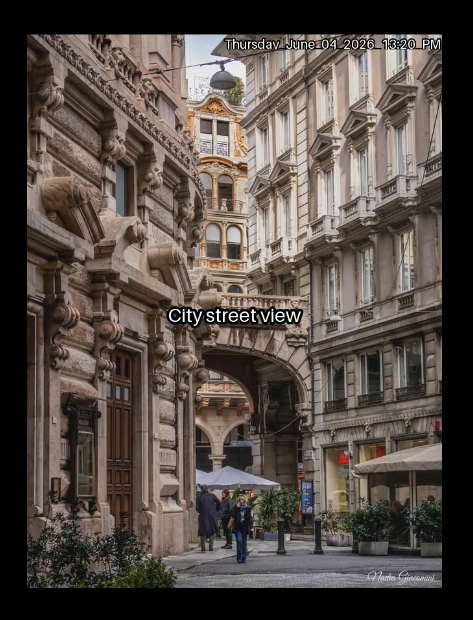

<div align="center">

# ⚡ AI VISUAL SONIFICATION ⚡

### Turning visual content into sound through AI driven semantic analysis and audio synthesis.

```text
🌐 Reddit → 🧭 Context Aware Curation → 👁️ Vision AI → 💬 Visual Description → 🎵 Frequency Mapping → 🎬 Audiovisual Composition
```

<div align="center">

<a href="https://www.loom.com/share/ef7ae457b4a779fe5ad1d6e68ba00" target="_blank">
  
</a>

[](https://www.loom.com/share/ef7ae457b4a779fe5ad1d6e68ba00)

</div>

<p>


</p>

*30 images · 30 seconds · 1 synthesized tone per image · local AI inference*

</div>

---

## What Is This?

**AI Visual Sonification** is a Python pipeline that transforms visual content into synthesized audio.

The system automatically selects visual content from Reddit using the current time and day as contextual information. It then uses the local LLaVA 13B vision language model to analyse each image and generate a short visual description.

That description is converted into a frequency value which is then used to generate a sine wave with NumPy. The resulting audio is paired with the corresponding image and assembled into a 30 second audiovisual composition.

The image does not contain or produce the sound. Instead, the project experiments with **sonification**, representing information extracted from an image through sound.

```text
Time and Day
     ↓
Context Aware Subreddit Selection
     ↓
Reddit Image
     ↓
LLaVA Vision Analysis
     ↓
Short Visual Description
     ↓
Semantic to Frequency Mapping
     ↓
Sine Wave Synthesis
     ↓
Image + Audio
     ↓
30 Second Audiovisual Composition
```

---

## Features

<table>
<tr>
<td align="center" width="33%">

### 🧭 Context Aware Curation

The system uses the current hour and day as context when selecting a subreddit from a pool of visual communities. Previously selected communities are tracked to reduce repetition.

</td>
<td align="center" width="33%">

### 👁️ Vision Understanding

LLaVA 13B analyses each downloaded image and generates a concise visual description of up to five words.

</td>
<td align="center" width="33%">

### 🎵 Visual Sonification

The generated description is interpreted by LLaVA and converted into a frequency value. That frequency is used to synthesize a unique sine wave for the image.

</td>
</tr>
<tr>
<td align="center" width="33%">

### 🎬 Audiovisual Composition

Each image is displayed for one second and paired with its corresponding synthesized audio before the clips are combined into a final 30 second video.

</td>
<td align="center" width="33%">

### 🧭 Subreddit Memory

Previously selected subreddits are stored in `visited.txt`, allowing future runs to explore different communities.

</td>
<td align="center" width="33%">

### 🔒 Local AI Processing

Vision analysis and audio generation are performed locally using Ollama, LLaVA and Python based audio synthesis.

</td>
</tr>
</table>

---

## The Sonification Process

The project does not attempt to recover hidden audio from an image.

Instead, it creates an audio representation from information extracted from the image.

For example:

```text
Image
 ↓
LLaVA
 ↓
"foggy mountain at dawn"
 ↓
Semantic interpretation
 ↓
Frequency selection
 ↓
Sine wave
```

The frequency represents the characteristics interpreted from the visual description rather than any actual acoustic property of the image.

The current system uses a simple frequency range to create three broad sonic characteristics:

| Visual Character      | Audio Representation |
| --------------------- | -------------------- |
| 🌿 Calm and still     | Lower frequency      |
| 🌅 Neutral and scenic | Mid range frequency  |
| ⚡ Vivid and energetic | Higher frequency     |

This intentionally simple mapping provides a foundation for experimenting with more sophisticated forms of visual sonification.

---

## How It Works

Each execution of `main.py` performs one stage of the collection process. This design allows the system to gradually build a collection of images before producing the final composition.

### 1. Context Aware Subreddit Selection

LLaVA receives information about the current date, hour and day of the week together with the available subreddit pool.

It selects a subreddit that fits the contextual information. Previously selected subreddits are stored in `visited.txt` to reduce repetition.

If the model cannot make a selection, the system can fall back to a random subreddit.

### 2. Image Extraction

Selenium opens the selected Reddit community and retrieves an image post.

The downloaded image is stored in:

```text
assets/images/
```

### 3. Vision Captioning

Each image is encoded and passed to LLaVA 13B.

The model is instructed to describe the image using no more than five words.

For example:

```text
foggy mountain at dawn
```

### 4. Frequency Mapping

The generated description is passed to LLaVA again with instructions to select a frequency within the configured range.

The model produces a frequency value in Hertz based on the semantic characteristics of the description.

This creates the project's semantic to frequency mapping.

### 5. Audio Synthesis

The selected frequency is passed to NumPy, which generates a sine wave.

An envelope is applied to the generated signal so that each short audio segment can smoothly begin and end.

### 6. Video Composition

MoviePy combines the image and its corresponding audio into one second clips.

The clips are then concatenated into a final audiovisual composition containing up to 30 images and their corresponding tones.

### Batch Process

```text
Run 1 to 29
    ↓
Fetch one image
    ↓
Save image
    ↓
Exit

Run 30
    ↓
30 images collected
    ↓
Generate captions
    ↓
Generate frequencies
    ↓
Synthesize audio
    ↓
Create video
    ↓
output.mp4

Next batch
    ↓
Reset collection
    ↓
Begin again
```

---

## Quick Start

### 1. Clone

```bash
git clone https://github.com/Sahil8877/Reddit-Speaks.git
cd Reddit-Speaks
```

### 2. Install Dependencies

```bash
pip install -r requirements.txt
```

### 3. Install Ollama and Pull LLaVA

```bash
curl -fsSL https://ollama.com/install.sh | sh
ollama pull llava:13b
```

### 4. Install Chrome

| OS      | Command                                                      |
| ------- | ------------------------------------------------------------ |
| macOS   | `brew install --cask google-chrome`                          |
| Linux   | `sudo apt install google-chrome-stable`                      |
| Windows | Download from [google.com/chrome](https://google.com/chrome) |

### 5. Run

```bash
python main.py
```

Run the program until the collection reaches 30 images.

The generated video is saved in:

```text
assets/output/output.mp4
```

---

## Configuration

| Parameter         | File                 | Default         | Description                                    |
| ----------------- | -------------------- | --------------- | ---------------------------------------------- |
| `SUBREDDITS`      | `get_topic.py`       | 60+ communities | Available communities for contextual selection |
| `MAX_IMAGE_COUNT` | `main.py`            | `30`            | Number of images used for one video            |
| `DURATION`        | `main.py`            | `1` second      | Duration of each image                         |
| Pitch range       | `get_audio_pitch.py` | 50 to 3000 Hz   | Allowed frequency range                        |
| Caption length    | `get_caption.py`     | Up to 5 words   | Maximum visual description length              |
| `retries`         | `main.py`            | `7`             | Number of attempts for processing              |

---

## Tech Stack

<table>
<tr>
<td width="50%">

| Component      | Technology            |
| -------------- | --------------------- |
| Language       | Python 3.11+          |
| Vision Model   | Ollama with LLaVA 13B |
| Web Automation | Selenium              |
| Browser        | Google Chrome         |

</td>
<td width="50%">

| Component         | Technology |
| ----------------- | ---------- |
| Image Download    | `requests` |
| Audio Synthesis   | NumPy      |
| Video Composition | MoviePy    |
| Image Encoding    | Base64     |

</td>
</tr>
</table>

---

## Project Structure

```text
AI Visual Sonification/
├── main.py                 # Pipeline orchestrator
├── get_topic.py            # Context aware subreddit selection
├── get_post.py             # Reddit image extraction
├── get_caption.py          # Vision captioning with LLaVA
├── get_audio_pitch.py      # Semantic to frequency mapping
├── make_frame_audio.py     # Sine wave audio synthesis
├── image_to_base64.py      # Image encoding utility
├── modules.py              # Shared imports
├── requirements.txt
├── visited.txt             # Subreddit selection history
└── assets/
    ├── images/             # Downloaded Reddit images
    ├── audio/              # Generated audio clips
    └── output/             # Final audiovisual composition
```

---

## Limitations

* Reddit UI changes may break Selenium selectors
* LLaVA 13B requires significant local memory and processing power
* The current audio system uses simple sine waves rather than complex musical synthesis
* The semantic to frequency mapping is intentionally experimental and relatively simple
* A complete composition requires collecting 30 images across multiple executions
* Reddit remains an external source of visual content even though AI inference and audio synthesis run locally

---

## Roadmap

* [ ] Replace Selenium with PRAW or another Reddit data access method
* [ ] Introduce richer harmonic and layered audio synthesis
* [ ] Develop a more sophisticated semantic to audio mapping system
* [ ] Introduce sentiment and emotional characteristics into audio modulation
* [ ] Add scheduled autonomous generation
* [ ] Add a lightweight web preview interface
* [ ] Add richer visual transitions and audio synchronization
* [ ] Explore alternative image sources beyond Reddit

---

## Troubleshooting

| Problem                             | Fix                                                               |
| ----------------------------------- | ----------------------------------------------------------------- |
| `UnboundLocalError: driver`         | Add `driver = None` before the Selenium logic in `get_post.py`    |
| No image saved or Reddit login wall | Run with a visible browser and authenticate manually if required  |
| LLaVA returns an invalid frequency  | Use a stricter prompt and validate the returned value             |
| `ollama.generate` timeout           | Ensure the Ollama service is running                              |
| Video rendering fails               | Install `imageio-ffmpeg`                                          |
| TextClip errors                     | Install ImageMagick if required by your MoviePy configuration     |
| `visited.txt` not updating          | Ensure subreddit names are stripped before comparison and writing |

---

<div align="center">

### AI Visual Sonification

**Exploring how visual information can be represented through sound.**


</div>
